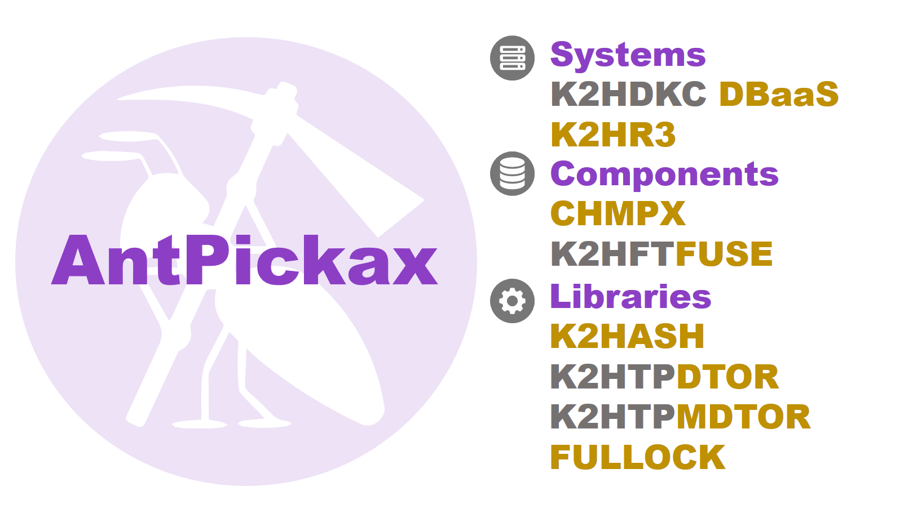

# **AntPickax**
**AntPickax** includes open source software products which are necessary for Internet services in Yahoo! JAPAN. It includes basic libraries, components and systems.

**AntPickax** is a series of a challenging product that made it easy to solve complicated problems. We hope **AntPickax** products are widely used and create next innovations!

We will keep challenging to publish new open source software as a **AntPickax** product(like an **Ant** working with a  **pickax**).

### **Background**
Though we use and contribute a lot of open source software in Yahoo! JAPAN, we have started producing **AntPickax** with the following background.
- Basic functions that are necessary internally are not sufficient.
- Adopting a new architecture to drastically reduce operating costs.
- Performance (mainly speed and scalability) is insufficient.
- License restrictions, it can not be introduced inside the company.

Among the created software, we have released software as an **AntPickax** product that has performance comparable to that of existing OSS and has useful functions not found in existing OSS.

### **AntPickax Product List**

**AntPickax** includes the following products.

- [**k2hr3**](https://k2hr3.antpick.ax/)  
**K2HR3** is an **RBAC**(**R**ole **B**ased **A**ccess **C**ontrol) system that cooperates with **IaaS**(Infrastructure as a Service).
- [**k2hdkc**](https://k2hdkc.antpick.ax/)  
A high performance and horizontal scalable distributed KVS cluster system based on [**k2hash**](https://k2hash.antpick.ax/) and [**chmpx**](https://chmpx.antpick.ax/).
- [**k2hdkc nodejs addon**](https://nodejs.k2hdkc.antpick.ax/)  
A Node.js addon library to implement [**k2hdkc**](https://k2hdkc.antpick.ax/)'s slave client process by JavaScript language.
- [**Java driver for k2hdkc**](https://java.k2hdkc.antpick.ax/)  
A Java driver for [**k2hdkc**](https://k2hdkc.antpick.ax/)
- [**k2hftfuse**](https://k2hftfuse.antpick.ax/)  
A component based on FUSE library which can transfer files, texts and logs at high speed and relay them and aggregate them.
- [**k2hash**](https://k2hash.antpick.ax/)  
A vey fast Key Value Store(KVS) library featuring very large file support and many useful functions.
- [**k2hash nodejs addon**](https://nodejs.k2hash.antpick.ax/)  
A Node.js addon library for using all [**k2hash**](https://k2hash.antpick.ax/) functions from your programs implemented by JavaScript language.
- [**chmpx**](https://chmpx.antpick.ax/)  
A very fast network communication middleware to construct a cluster.
- [**chmpx nodejs addon**](https://nodejs.chmpx.antpick.ax/)  
A Node.js addon library to use [**chmpx**](https://chmpx.antpick.ax/) communication function from server/slave program implemented by JavaScript language.
- [**k2htpdtor**](https://k2htpdtor.antpick.ax/)  
A standard plug-in library for processing transaction data linked to the [**k2hash**](https://k2hash.antpick.ax/) library.
- [**k2htpmdtor**](https://k2htpmdtor.antpick.ax/)  
Another plug-in library for processing transaction data linked to the [**k2hash**](https://k2hash.antpick.ax/) library.
- [**fullock**](https://fullock.antpick.ax/)  
A very fast and powerful lock library for multithread and multiprocess used in [**k2hash**](https://k2hash.antpick.ax/), [**chmpx**](https://chmpx.antpick.ax/).

# **AntPickax Products**

## {{ page.title_k2hr3 }}
[**k2hr3**](https://k2hr3.antpick.ax/) (**K2H**dkc based **R**esource and **R**oles and policy **R**ules) is one of **RBAC** (**R**ole **B**ased **A**ccess **C**ontrol) systems provided by Yahoo! JAPAN.  
[**k2hr3**](https://k2hr3.antpick.ax/) works as **RBAC** in cooperation with **OpenStack** which is one of **IaaS** (Infrastructure as a Service), and also provides **useful functions** for using RBAC.  

[**k2hr3**](https://k2hr3.antpick.ax/) gathers common management information for the cloud, and is built [**k2hash**](https://k2hash.antpick.ax/), [**k2htp_dtor**](https://k2htpdtor.antpick.ax/), [**chmpx**](https://chmpx.antpick.ax/) and [**k2hdkc**](https://k2hdkc.antpick.ax/) components.  

[**k2hr3**](https://k2hr3.antpick.ax/) consists of the following components.  
Please refer to the following for details.  
- **Information aggregation of k2hr3** - {{ page.github_icon }}[**Codes on github**](https://github.com/yahoojapan/k2hr3) and {{ page.antpickax_icon }}[**Documents**](https://k2hr3.antpick.ax/)

- **Web Application** - {{ page.github_icon }}[**Codes on github**](https://github.com/yahoojapan/k2hr3_app) and {{ page.antpickax_icon }}[**Demonstration**](https://demo.k2hr3.antpick.ax/)

- **REST API** - {{ page.github_icon }}[**Codes on github**](https://github.com/yahoojapan/k2hr3_api)

- **OpenStack Notification Listener** - {{ page.github_icon }}[**Codes on github**](https://github.com/yahoojapan/k2hr3_osnl)

- **Utilities** - {{ page.github_icon }}[**Codes on github**](https://github.com/yahoojapan/k2hr3_utils)

- **Container Registration Sidecar** - {{ page.github_icon }}[**Codes on github**](https://github.com/yahoojapan/k2hr3_sidecar)

## {{ page.title_k2hdkc }}
k2hdkc(**k2h**ash based **D**istributed **K**vs **C**luster) is a high performance and horizontal scalable distributed KVS cluster system based on [**k2hash**](https://k2hash.antpick.ax/), [**chmpx**](https://chmpx.antpick.ax/) Distributed Key Value Store(KVS).  

The k2hdkc has unique features shown below.
- **Consistency** (Automatic Data Synchronization between Server Nodes)  
Provides automatic merging function of data due to failure/recovery of server nodes in the cluster.
- **Automatic Scaling**  
Server nodes can be added/deleted to the cluster, and the data automatic merging function at this time is also provided.
- **Nested key structure**  
Provides the association function of key and subkey which is the feature of [**k2hash**](https://k2hash.antpick.ax/) as distributed KVS.
- **Queue(FIFO/LIFO)**  
Provides the queuing function which is the feature of [**k2hash**](https://k2hash.antpick.ax/) as distributed KVS.
- **Transaction Plugins**  
Provides a function that can perform arbitrary processing using data update processing which is the feature of [**k2hash**](https://k2hash.antpick.ax/) as a trigger of transaction.
- **Encryption**  
Provides encryption function as distributed KVS for the key's data held as the feature of [**k2hash**](https://k2hash.antpick.ax/).
- **Expiration**  
Provides the key expiration function which is the feature of [**k2hash**](https://k2hash.antpick.ax/) as distributed KVS.

For details, please refer to {{ page.github_icon }}[**Codes on github**](https://github.com/yahoojapan/k2hdkc), {{ page.antpickax_icon }}[**Documents**](https://k2hdkc.antpick.ax/).

## {{ page.title_k2hdkc_nodejs }}
[**k2hdkc nodejs addon**](https://nodejs.k2hdkc.antpick.ax/)（**K2HDKC** nodejs addon - k2hash based distributed kvs cluster) is a Node.js addon library of [**k2hdkc**](https://k2hdkc.antpick.ax/).  
Using this library, [**k2hdkc**](https://k2hdkc.antpick.ax/)'s slave side client application can be implemented with Node.js based JavaScript.  
[**k2hdkc nodejs addon**](https://nodejs.k2hdkc.antpick.ax/) provides all functions and features necessary for the slave side client of distributed KVS of [**k2hdkc**](https://k2hdkc.antpick.ax/).  

For details, please refer to {{ page.github_icon }}[**Codes on github**](https://github.com/yahoojapan/k2hdkc_nodejs), {{ page.antpickax_icon }}[**Documents**](https://nodejs.k2hdkc.antpick.ax/).

## {{ page.title_k2hdkc_java }}
[**Java Driver for K2HDKC**](https://java.k2hdkc.antpick.ax/index.html)（Java Driver for **K2HDKC**) is an official Java client library for [**k2hdkc**](https://k2hdkc.antpick.ax/index.html). This library provies all functions and features necessary for the slave side client of distributed KVS of [**k2hdkc**](https://k2hdkc.antpick.ax/). That means eveyone is able to implement [**k2hdkc**](https://k2hdkc.antpick.ax/)'s slave side client application by using this library. See the following documents for details.

- {{ page.github_icon }}[**Code on GitHub**](https://github.com/yahoojapan/k2hdkc_java)
- {{ page.antpickax_icon }}[**Project Documentation**](https://java.k2hdkc.antpick.ax/index.html)
- {{ page.antpickax_icon }}[**API Documentation**](https://java.k2hdkc.antpick.ax/apidocs/index.html)

## {{ page.title_k2hftfuse }}
[**k2hftfuse**](https://k2hftfuse.antpick.ax/)(**k2h**ash **F**ile **T**ransaction by **FUSE** based file system) is [FUSE (Filesystem in Userspace)](https://github.com/libfuse/libfuse) is a file/message transfer system using the user space mounting function.  

[**k2hftfuse**](https://k2hftfuse.antpick.ax/) is a system developed to realize **reliable** and **fast** file/message transfer at low cost.  
[**k2hftfuse**](https://k2hftfuse.antpick.ax/) provides a virtual file system, you can use it by writing the file to the mounted directory.  
Just by mounting the directory of the output file of the existing program with [**k2hftfuse**](https://k2hftfuse.antpick.ax/), you can transfer files/messages **without changing** the existing program.

- **Zero cost integration with applications**  
Additional API dependency for client applications is zero!
- **Very fast and reliable file transfer**  
Very fast and reliable file transfer based on [**k2hash**](https://k2hash.antpick.ax/) and [**chmpx**](https://chmpx.antpick.ax/).
- **Various data format**  
Supported data formats are a single data message, a text file and a binary file.
- **Filter**  
Processing data for your purpose very easily!
- **Trigger**  
Invoking your own function against particular data.

For details, please refer to {{ page.github_icon }}[**Codes on github**](https://github.com/yahoojapan/k2hftfuse), {{ page.antpickax_icon }}[**Documents**](https://k2hftfuse.antpick.ax/).

## {{ page.title_k2hash }}
[**k2hash**](https://k2hash.antpick.ax/) is a NoSQL Key Value Store(KVS) library.
[**k2hash**](https://k2hash.antpick.ax/) has basic KVS functions and unique features shown below.

- **High speed**  
Access to data(read and write) is very fast.
- **Multi-threadeding/multi-processing available**  
The client program can use this library in multi process, multithreading.
- **Binary data**  
Can use binary(any types of value) and variable length array(VLA) for Key and Value.
- **Automatic expansion of data area/low fragment**  
Dynamically extends the data area(for data and hash table).  
Use paging to minimize fragments.
- **Data storage/mapping type**  
Can store data on memory(volatile), persistent file(including temporary file).  
In the case of persistent files, it provides a mapping method for the whole file(data maintained at high speed and persisted) and index only(large capacity).
- **Nested key structure**  
In addition to KVS's ability to store values for keys, you can associate other keys as keys to subkeys.
- **Transaction Plugins**  
Can implement your own processing by triggering data update processing as a transaction trigger.
- **Archiving**  
Data update processing can be output as an archive file as embedded transaction processing.
- **Queue(FIFO/LIFO)**  
Queue(FIFO/LIFO) can be configured as data of [**k2hash**](https://k2hash.antpick.ax/) and you can push/pop from it.
- **Attributes**  
Attributes(embedded or customized) can be set for the key.
- **Encryption**  
Can encrypt the key value and save it.
- **History**  
Can keep the update history of the key and this function can be used as a versioning for data.
- **Expiration**  
A function that can set the expiration date of the key as an attribute.

For details, please refer to {{ page.github_icon }}[**Codes on github**](https://github.com/yahoojapan/k2hash), {{ page.antpickax_icon }}[**Documents**](https://k2hash.antpick.ax/).

## {{ page.title_k2hash_nodejs }}
[**k2hash nodejs addon**](https://nodejs.k2hash.antpick.ax/)（**K2HASH** nodejs addon - NoSQL Key Value Store(KVS) nodejs library) is a Node.js addon library of [**k2hash**](https://k2hash.antpick.ax/).  
Using this library, you can operate [**k2hash**](https://k2hash.antpick.ax/)'s data from your Node.js based JavaScript program.  
[**k2hash nodejs addon**](https://nodejs.k2hash.antpick.ax/) provides all functions and features of [**k2hash**](https://k2hash.antpick.ax/).  

For details, please refer to {{ page.github_icon }}[**Codes on github**](https://github.com/yahoojapan/k2hash_nodejs), {{ page.antpickax_icon }}[**Documents**](https://nodejs.k2hash.antpick.ax/).

## {{ page.title_chmpx }}
[**chmpx**](https://chmpx.antpick.ax/) (**C**onsistent **H**ashing **M**q in**P**rocess data e**X**change) is a communication middleware for sending and receiving binary data between processes that cross network.

- **Basic functions**  
[**chmpx**](https://chmpx.antpick.ax/) is responsible for communication between the server program and the client program, and hides the network communication connection from each program.
- **Cluster/Multiplexing/Auto scaling**  
[**chmpx**](https://chmpx.antpick.ax/) is a communication middleware that can create a cluster configuration, has high fault tolerance and multiplexing, and can be autoscaled.
- **Communication data**  
The format of the data to communicate is free, and it can communicate binary data and large size data.
- **Communication encryption**  
Supports communication with SSL.
- **Communication multiplexing/Parallel processing**  
Can multiplex and parallel communication between [**chmpx**](https://chmpx.antpick.ax/) server and slave.
- **Queuing communication data**  
Data to be transmitted/received is queued and data will not be lost even with small delay due to high load etc.
- **Multi-threading/Multi-processing**  
The client program can use this component in multi process, multithreading.

For details, please refer to {{ page.github_icon }}[**Codes on github**](https://github.com/yahoojapan/chmpx), {{ page.antpickax_icon }}[**Documents**](https://chmpx.antpick.ax/).

## {{ page.title_chmpx_nodejs }}
[**chmpx nodejs addon**](https://nodejs.chmpx.antpick.ax/)（**CHMPX** nodejs addon - Consistent Hashing Mq inProcess data eXchange) is a Node.js addon library of [**chmpx**](https://chmpx.antpick.ax/).  
Using this library, both server side and slave side of communication program using [**chmpx**](https://chmpx.antpick.ax/) can be implemented with Node.js based JavaScript program.  
[**chmpx nodejs addon**](https://nodejs.chmpx.antpick.ax/) provides all functions and features of [**chmpx**](https://chmpx.antpick.ax/).  

For details, please refer to {{ page.github_icon }}[**Codes on github**](https://github.com/yahoojapan/chmpx_nodejs), {{ page.antpickax_icon }}[**Documents**](https://nodejs.chmpx.antpick.ax/).

## {{ page.title_k2htpdtor }}
[**k2htp_dtor**](https://k2htpdtor.antpick.ax/)(**k2h**ash **T**ransaction **P**lugin **D**istributed **T**ransaction **O**f **R** epeater) easily duplicates the [**k2hash**](https://k2hash.antpick.ax/) data by transferring the transaction data of [**k2hash**](https://k2hash.antpick.ax/) to another host using [**chmpx**](https://chmpx.antpick.ax/).  

This library is a standard transaction plugin library compatible with the [**k2hash**](https://k2hash.antpick.ax/) library provided by Yahoo! JAPAN.  
This provides a general tool for users to process their own transactions as transaction triggers.

For details, please refer to {{ page.github_icon }}[**Codes on github**](https://github.com/yahoojapan/k2htp_dtor), {{ page.antpickax_icon }}[**Documents**](https://k2htpdtor.antpick.ax/).

## {{ page.title_k2htpmdtor }}
[**k2htp_mdtor**](https://k2htpmdtor.antpick.ax/)(**k2h**ash **T**ransaction **P**lugin **M**ultiple **D**istributed **T**ransaction **O**f **R** epeater) easily duplicates the [**k2hash**](https://k2hash.antpick.ax/) data by transferring the transaction data of [**k2hash**](https://k2hash.antpick.ax/) to another host using [**chmpx**](https://chmpx.antpick.ax/).  

The main purpose of **k2htp_mdtor**, which loads multiple [**k2hash**](https://k2hash.antpick.ax/) transaction plugins, is to call the arbitrary function defined in them. When calling the each function, **k2htp_mdtor** passes [**k2hash**](https://k2hash.antpick.ax/) transaction logs to it as a function's parameter. A common [**k2hash**](https://k2hash.antpick.ax/) transaction plugin loads no other one. We recommend you to use **k2htp_mdtor** if you want to use multiple [**k2hash**](https://k2hash.antpick.ax/) transaction plugins.

For details, please refer to {{ page.github_icon }}[**Codes on github**](https://github.com/yahoojapan/k2htp_mdtor), {{ page.antpickax_icon }}[**Documents**](https://k2htpmdtor.antpick.ax/).

## {{ page.title_fullock }}
[**fullock**](https://fullock.antpick.ax/)(**F**ast **U**ser **L**evel **LOCK** library) is a low-level lock library that provides a safe and fast locking function for multiprocess, multithreaded programs.  
This library is also used by other AntPickax products such as [**k2hash**](https://k2hash.antpick.ax/), [**chmpx**](https://chmpx.antpick.ax/).

For details, please refer to {{ page.github_icon }}[**Codes on github**](https://github.com/yahoojapan/fullock), {{ page.antpickax_icon }}[**Documents**](https://fullock.antpick.ax/).
